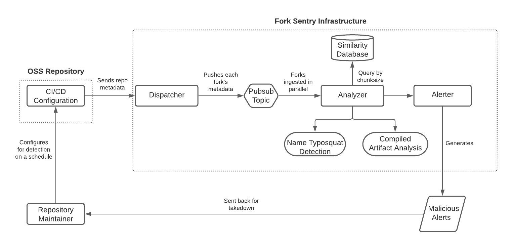

# Fork Sentry

Detect and alert on suspicious forks of your repository

## Introduction

__Fork Sentry__ is a [GitHub Action](https://github.com/features/actions) that reports on
suspicious forks of your repository that may be serving malicious artifacts.

In the past, __Fork Sentry__ has already found and taken down instances of:

* Typosquatted accounts serving modified releases
* Malicious cryptominers part of C2 infrastructures

(TODO: include writeups, and links to paper releases)

## Usage

__Fork Sentry__ operates out of a seperate cloud infrastructure, which you can self-host with our open-sourced code, or reach out for an API token (WIP) to the existing one. This way we're able to scale analysis to large volumes of forks, while outsourcing scheduling to Action's CI/CD runner.

```yml
name: Check for suspicious forks
on:
  schedule:
    - cron: '0 10 * * 1' # Checks for updates every Monday at 10:00 AM

jobs:
  fork-sentry:
    runs-on: ubuntu-latest
    steps:
      - uses: ex0dus-0x/fork-sentry@v1.0
        with:

          # required for authentication and recovering forks
          github_token: ${{ secrets.GITHUB_TOKEN }}
          fork_sentry_token: ${{ secrets.FORK_SENTRY_API }}

          # if self-hosting, replace with dispatcher endpoint
          #infra_endpoint: https://fork-sentry-instance.example.com

          # optional: integrate for VirusTotal Enterprise support
          vt_token: ${{ secrets.VT_API_TOKEN }}
```

### Restrictions

* Users must have a valid API token to trigger dispatch an analysis
* Analysis jobs can only be run at a minimum of every 6 hours
* Rate limiting against the dispatching endpoint will still be imposed to block large volumes of requests

## Architecture



For more information about self-hosting, check out the spec here.

### Dispatcher

The Golang dispatcher ingests authenticated requests for analysis of a target parent repository. The request can
be invoked adhoc similarly like so:

```
$ curl -X POST -d '{"owner":"OWNER", "name": "NAME", "github_token": "ghp_TOKEN", "api_token": "API_TOKEN"}' -H 'Content-Type: application/json' https://endpoint.example/dispatch
```

or preferably through the Actions runner itself, which can be put on a schedule. The __dispatcher__ extracts all forks and publishes each for analyzers to subscribe and
consume.

### Analyzer

For an individual fork, we check the following:

* Name typosquatting
* Known malware signatures
* Suspicious capabilities

Previously detected samples are also checked using their _locality-sensitive hashes_ against a database with [this technique](https://www.virusbulletin.com/virusbulletin/2015/11/optimizing-ssdeep-use-scale).

### Alert Function

Potentially malicious forks are written back to the issue tracker in this step.

## License

Fork Sentry is release under a Apache License 2.0 License
